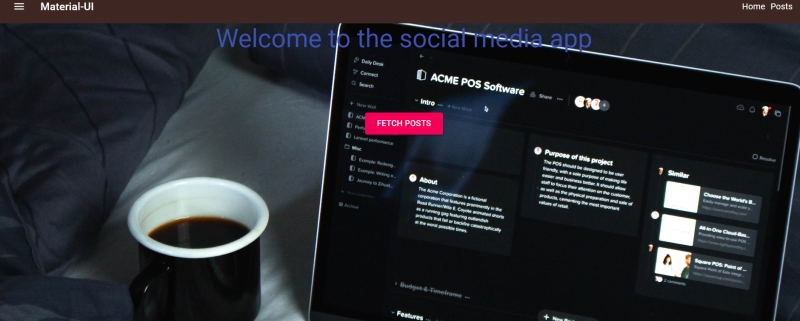

# Post Routes

Website Link: [Post Routes](https://postroutes.netlify.app/ "Post Routes")

Created a reactjs app where post api was fetched from
jsonplaceholder website and displayed different routes based on
clicking of different posts.

Environment : Reactjs,Redux,Javascript, NodeJS,Material-UI,netlify

- Users can fetch post and see all the post from received from jsonplacholder api 
- Clicking on a particular post will take user to a new page to see details of that post 
- Comments from the api for any particular post has been fetched and added to that post

To run this app in your editor,clone this project and run the command npm start to start downloading the necessary packages.
